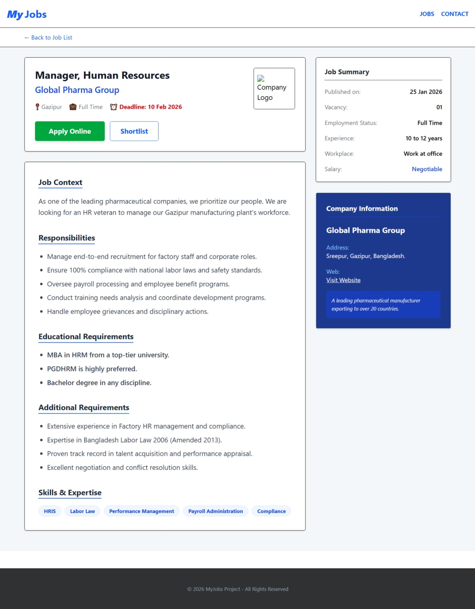

# MyJobs - Full Stack Job Portal

A professional job portal application inspired by clean, data-driven circular designs. This project features a **FastAPI** backend and a **Vue.js 3** frontend, allowing users to browse job listings and view detailed job requirements.

## 🚀 Features
- **Job Listings:** Real-time job feed fetched from a REST API.
- **Dynamic Details Page:** Specific views for every job using Vue Router.
- **Advanced Filtering:** Instant search by job title or company name.
- **Responsive Design:** Fully optimized for Mobile, Tablet, and Desktop using Tailwind CSS.
- **Professional Layout:** Includes a comprehensive footer, support contact info, and "Apply" workflow.

## 🛠️ Tech Stack
- **Frontend:** Vue.js 3 (Composition API), Vite, Vue Router, Tailwind CSS.
- **Backend:** FastAPI (Python), Pydantic, Uvicorn (CORS enabled).
- **Database:** Mock JSON database (Ready for PostgreSQL integration).

---

## 📁 Project Structure
```text
job-portal/
├── job-portal-backend/    # FastAPI Python code
│   ├── main.py            # API endpoints & Data logic
│   └── requirements.txt   # Backend dependencies
└── job-portal-frontend/   # Vue.js code
    ├── src/
    │   ├── views/         # HomeView.vue & JobDetail.vue
    │   ├── router/        # Navigation logic
    │   └── App.vue        # Main application shell
    └── package.json       # Frontend dependencies

---

## 🔧 Installation & Setup

### 1️⃣ Backend Setup

Navigate to the backend folder and set up your environment:

```bash
cd job-portal-backend
python -m venv venv
```

Activate the virtual environment:

```bash
# Windows
venv\Scripts\activate

# Mac / Linux
source venv/bin/activate
```

Install dependencies and start the server:

```bash
pip install -r requirements.txt
uvicorn main:app --reload
```

The API will be available at:
http://127.0.0.1:8000

---

### 2️⃣ Frontend Setup

Open a new terminal, navigate to the frontend folder, and install dependencies:

```bash
cd job-portal-frontend
npm install
npm run dev
```

The application will be available at:
http://localhost:5173

---

## 📁 Project Structure

job-portal/
├── job-portal-backend/
│   ├── main.py
│   ├── requirements.txt
│   └── venv/
├── job-portal-frontend/
│   ├── src/
│   ├── package.json
│   └── vite.config.js
└── README.md

---

## 📸 Screenshots

(Add screenshots here later)

Home Page:


Job Details Page:


---

## ⚙️ API Overview

GET    /jobs        → Get all jobs
GET    /jobs/{id}   → Get job details
POST   /jobs        → Add a new job

---

## 🧑‍💻 Developer Notes

- Swagger UI: http://127.0.0.1:8000/docs
- ReDoc: http://127.0.0.1:8000/redoc
- Run backend and frontend in separate terminals
- Use .env for environment variables

---

## 💡 Pro Tips for GitHub

1. Add a Social Preview from repository settings
2. Update requirements.txt regularly:
   pip freeze > requirements.txt
3. Use .gitignore to exclude venv, node_modules, and .env

---

## ⚖️ License

This project is for educational purposes only.

---

## 🤝 Contact

Your Name
your-email@example.com
https://github.com/yourusername/job-portal

⭐ If you like this project, don’t forget to give it a star!
